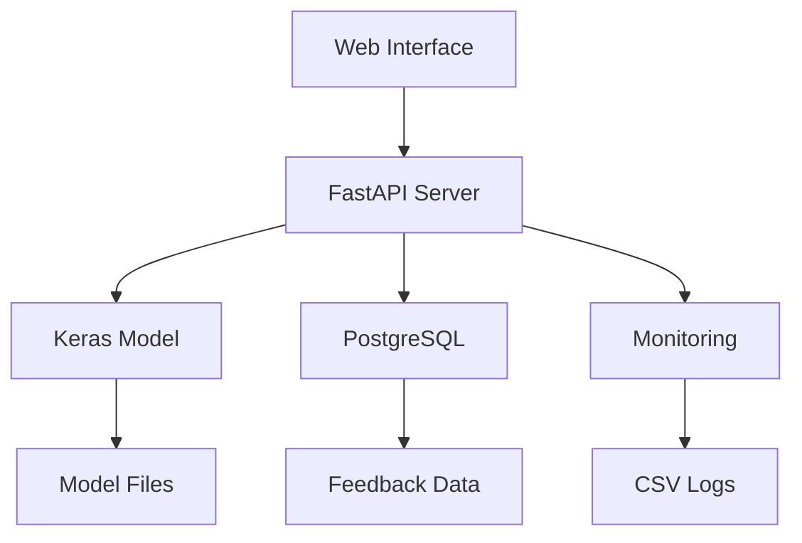
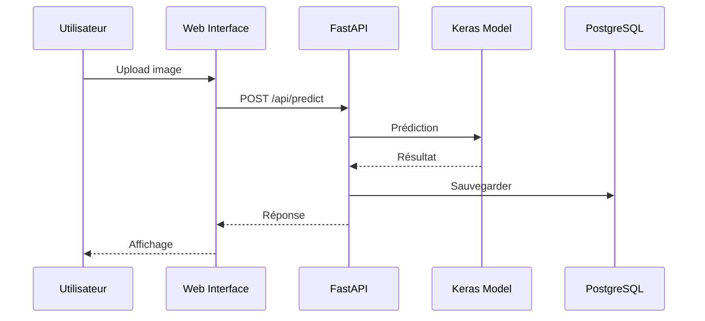

# Computer Vision - Classification d'images Cats & Dogs

[](https://www.python.org)
[](https://fastapi.tiangolo.com/)
[](https://keras.io/)
[](LICENSE)
[](CONTRIBUTING.md)

<div align="center">

<h3>Classification d'images avec Keras et exposition du modèle via Fast API</br></h3>

[Explore the docs](docs/)

</div>

---

## 📌 Introduction

Ce projet est à vocation pédagogique sur des thématiques IA et MLOps. Il permet de réaliser des tâches de Computer Vision et spécifiquement de la classification d'images par la reconnaissance de chats et de chiens.  
Il est composé de :

- Un modèle de computer vision développé avec Keras 3 selon une architecture CNN. Voir le tutoriel Keras ([lien](https://keras.io/examples/vision/image_classification_from_scratch/)).
- Un service API développé avec Fast API, qui permet notamment de réaliser les opérations d'inférence (i.e prédiction), sur la route `/api/predict`.
- Une application web minimaliste (templates Jinja2).
- Des tests automatisés minimalistes (pytest).
- Un pipeline CI/CD minimaliste (Github Action).

## 📁 Structure du projet

```txt
project-name/
├── .github/
│   ├── workflows/           # CI/CD pipelines
│   └── ISSUE_TEMPLATE/      # Templates d'issues
├── config/                  # Fichiers de configuration
├── data/
│   ├── raw/                 # Données brutes (gitignored)
│   ├── processed/           # Données traitées (gitignored)
│   └── external/            # Données externes/références
├── docker/                  # Dockerfiles et compose
├── docs/                    # Documentation
├── notebooks/               # Jupyter notebooks pour exploration
├── requirements/            # Dépendances par environnement
│   ├── base.txt
│   ├── dev.txt
│   └── prod.txt
├── scripts/                 # Scripts d'automatisation/déploiement
├── src/                     # Code source principal
│   ├── api/                 # APIs et services web
│   ├── data/                # Scripts de traitement des données
│   ├── models/              # Modèles ML/IA
│   ├── monitoring/          # Monitoring des modèles
│   ├── utils/               # Utilitaires partagés
│   └── web/                 # Templates jinja2
├── tests/                   # Tests unitaires et d'intégration
├── .env.example             # Variables d'environnement exemple
├── .gitignore
├── README.md
├── Makefile                 # Commandes fréquentes
└── pyproject.toml           # Configuration Python/packaging
```

## 🚀 Installation et Configuration

### Prérequis

- **Python** 3.8 ou supérieur
- **PostgreSQL** 12 ou supérieur
- **Git** pour cloner le repository

### Installation

1. **Cloner le repository**
```bash
git clone <repository-url>
cd computer-vision-cats-and-dogs
```

2. **Créer un environnement virtuel**
```bash
python -m venv venv
# Windows
venv\Scripts\activate
# Linux/Mac
source venv/bin/activate
```

3. **Installer les dépendances**
```bash
pip install -r requirements/base.txt
```

4. **Configurer la base de données**
```bash
# Créer la base de données
createdb computer-vision-cats-dogs

# Exécuter le script de création des tables
psql -d computer-vision-cats-dogs -f scripts/setup_database.sql
```

5. **Configurer les variables d'environnement**
```bash
# Copier le fichier d'exemple
cp .env.example .env

# Éditer les variables selon votre configuration
# DB_HOST=localhost
# DB_PORT=5432
# DB_NAME=computer-vision-cats-dogs
# DB_USER=postgres
# DB_PASSWORD=your_password
# API_TOKEN=your_secure_token
```

## 🛠️ Commandes utiles

```bash
# Installation
make env                    # Installer les dépendances dans un environnement virtuel
pip install -r requirements/base.txt  # Installation manuelle

# Base de données
psql -d computer-vision-cats-dogs -f scripts/setup_database.sql  # Créer les tables

# Démarrage
python scripts/run_api.py   # Démarrer l'API

# Tests
python -m pytest tests/     # Exécuter tous les tests
python -m pytest tests/test_api_simple.py -v  # Tests rapides
RUN_DB_TESTS=1 python -m pytest tests/test_metrics_api.py -v  # Tests avec DB
```

## 🎯 API

### Démarrage

```bash
python scripts/run_api.py
```

L'API sera disponible sur `http://localhost:8000`

### Documentation Interactive

Visitez la page de documentation Swagger : `http://localhost:8000/docs`


### Endpoints Principaux

#### 1. **Prédiction d'image**
```bash
POST /api/predict
Authorization: Bearer <token>
Content-Type: multipart/form-data

# Exemple avec curl
curl -X POST "http://localhost:8000/api/predict" \
     -H "Authorization: Bearer ?C@TS&D0GS!" \
     -F "file=@mon_image.jpg"
```

**Réponse :**
```json
{
  "filename": "mon_image.jpg",
  "prediction": "Dog",
  "confidence": "87.65%",
  "probabilities": {
    "cat": "12.35%",
    "dog": "87.65%"
  }
}
```

#### 2. **Feedback utilisateur**
```bash
POST /api/feedback
Authorization: Bearer <token>
Content-Type: application/json

# Exemple avec curl
curl -X POST "http://localhost:8000/api/feedback" \
     -H "Authorization: Bearer ?C@TS&D0GS!" \
     -H "Content-Type: application/json" \
     -d '{
       "feedback": "positive",
       "resultat_prediction": 0.8765,
       "input_user": "mon_image.jpg"
     }'
```

#### 3. **Métriques de performance**
```bash
GET /api/metrics/daily    # Métriques journalières
GET /api/metrics/7d       # Résumé 7 jours
GET /api/health          # Santé de l'API
```

### Authentification

Tous les endpoints API nécessitent un token d'authentification :
- **Header** : `Authorization: Bearer <token>`
- **Token par défaut** : `?C@TS&D0GS!` (configurable dans `config/settings.py`)

## 📊 Application Web

### Interface Utilisateur

L'application web fournit une interface simple pour :
- **Upload d'images** : Glisser-déposer ou sélection de fichiers
- **Prédiction en temps réel** : Classification instantanée chat/chien
- **Feedback utilisateur** : Évaluation des prédictions
- **Visualisation des résultats** : Scores de confiance et probabilités

### Accès

1. **Démarrer l'API** :
```bash
python scripts/run_api.py
```

2. **Ouvrir dans le navigateur** : `http://localhost:8000`


### Fonctionnalités

- ✅ **Upload d'images** : Support des formats JPG, PNG, GIF
- ✅ **Prédiction instantanée** : Résultats en temps réel
- ✅ **Interface responsive** : Compatible mobile et desktop
- ✅ **Feedback intégré** : Boutons pour évaluer les prédictions
- ✅ **Documentation API** : Lien vers Swagger UI

## 🏗️ Architecture Technique

### Architecture Globale



### Flux d'Interaction



### Flux de Données

1. **Upload d'image** → Client envoie l'image via POST
2. **Prédiction** → Modèle Keras classifie l'image
3. **Réponse** → API retourne prédiction + confiance
4. **Feedback** → Utilisateur évalue la prédiction
5. **Stockage** → Données sauvegardées en base PostgreSQL
6. **Monitoring** → Métriques enregistrées pour analyse

### Technologies Utilisées

- **Backend** : FastAPI (Python 3.8+)
- **ML** : Keras 3 + TensorFlow
- **Base de données** : PostgreSQL
- **Frontend** : Jinja2 Templates + Bootstrap
- **Monitoring** : CSV + Base de données
- **Tests** : pytest

## 🔒 Conformité RGPD (Base de données & Monitoring)

Cette application enregistre certaines informations d’inférence et de feedback dans une base PostgreSQL afin d’améliorer le modèle et de suivre ses performances.

- Finalités: amélioration continue du modèle (ré‑entraînement) et monitoring des performances (temps d’inférence, taux d’accord). Aucune finalité marketing.
- Catégories de données: métadonnées techniques d’inférence (date, succès/erreur, temps d’inférence) et feedback utilisateur (positif/négatif). Pas de données personnelles identifiables (DPI) prévues par défaut. Si un fichier ou un identifiant utilisateur est stocké, il doit être pseudonymisé.
- Base légale: intérêt légitime (optimisation du service) ou consentement si un lien peut être fait avec une personne identifiée/identifiable.
- Minimisation: ne stocker que le strict nécessaire (résultats agrégés, noms de fichiers non sensibles/pseudonymisés). Éviter tout contenu d’image en base; conserver les images sur un stockage séparé et contrôlé si besoin.
- Conservation: définir une politique (ex. 180 jours pour les logs d’inférence; 365 jours max pour les feedbacks) avec purge automatique (tâches planifiées/SQL).
- Droits des personnes: prévoir des moyens de suppression/rectification si des données personnelles sont traitées; documenter les procédures.
- Sécurité: restreindre l’accès à la base (comptes de service, rôles/ACL), chiffrer les mots de passe en variables d’environnement, activer TLS entre services si possible, sauvegardes chiffrées et testées.
- Sous‑traitance/Transferts: si hébergement/cloud, s’assurer d’un accord de traitement (DPA) et de la localisation des données conforme (UE/clauses types).
- Journalisation: tracer les accès administratifs et les opérations de maintenance.
- DPIA: non requise a priori pour ces données techniques. À ré‑évaluer si des DPI sont ajoutées.

Note: si vous ajoutez des champs pouvant identifier un utilisateur (email, ID, IP…), mettez à jour cette section, anonymisez/pseudonymisez les données et, si nécessaire, recueillez le consentement explicite.

## 🧪 Tests

### Exécution des Tests

```bash
# Tests rapides (sans base de données)
python -m pytest tests/test_api_simple.py -v

# Tests complets (nécessite l'API démarrée)
python -m pytest tests/test_api.py -v

# Tests avec base de données
RUN_DB_TESTS=1 python -m pytest tests/test_metrics_api.py -v

# Tous les tests
python -m pytest tests/ -v
```

### Types de Tests

- **`test_api_simple.py`** : Tests de santé de l'API
- **`test_api.py`** : Tests complets (prédiction, feedback, auth)
- **`test_metrics_api.py`** : Tests des endpoints de monitoring
- **`test_models.py`** : Tests de chargement du modèle ML

### Prérequis pour les Tests

1. **API démarrée** : `python scripts/run_api.py`
2. **Base de données** : PostgreSQL configurée et accessible
3. **Dépendances** : `pip install pytest requests`

## 🚀 Déploiement

### Développement

```bash
# Environnement de développement
python -m venv venv
source venv/bin/activate  # Linux/Mac
# ou
venv\Scripts\activate     # Windows

pip install -r requirements/base.txt
python scripts/run_api.py
```

### Production

1. **Configuration serveur**
```bash
# Variables d'environnement
export DB_HOST=your_db_host
export DB_PASSWORD=secure_password
export API_TOKEN=secure_token

# Installation
pip install -r requirements/base.txt
```

2. **Démarrage avec Gunicorn**
```bash
pip install gunicorn
gunicorn -w 4 -k uvicorn.workers.UvicornWorker src.api.main:app
```

3. **Démarrage avec Docker** (optionnel)
```bash
docker build -t cats-dogs-api .
docker run -p 8000:8000 cats-dogs-api
```

## 🔧 Dépannage

### Problèmes Courants

#### 1. **Erreur de connexion à la base de données**
```bash
# Vérifier la connexion
psql -h localhost -U postgres -d computer-vision-cats-dogs

# Vérifier les variables d'environnement
echo $DB_HOST $DB_PORT $DB_NAME
```

#### 2. **Modèle non chargé**
```bash
# Vérifier que le fichier modèle existe
ls -la data/processed/model.keras

# Vérifier les logs
python scripts/run_api.py --verbose
```

#### 3. **Port déjà utilisé**
```bash
# Changer le port dans scripts/run_api.py
uvicorn.run(app, host="127.0.0.1", port=8001)
```

#### 4. **Erreur de dépendances**
```bash
# Réinstaller les dépendances
pip install --upgrade -r requirements/base.txt

# Vérifier la version Python
python --version  # Doit être 3.8+
```

### Logs et Debug

```bash
# Activer les logs détaillés
export LOG_LEVEL=DEBUG
python scripts/run_api.py

# Vérifier les logs de monitoring
tail -f data/processed/monitoring_inference.csv
```

### Performance

- **Latence élevée** : Vérifier la taille des images (redimensionnement automatique)
- **Mémoire** : Le modèle Keras charge en mémoire (~100MB)
- **Base de données** : Indexer les colonnes fréquemment utilisées

## 📈 Monitoring et Métriques

### Métriques Disponibles

- **Latence d'inférence** : Temps de réponse moyen
- **Volume de requêtes** : Nombre d'inférences par jour
- **Taux de satisfaction** : Pourcentage de feedbacks positifs
- **Taux d'erreur** : Pourcentage de prédictions échouées

### Endpoints de Monitoring

```bash
GET /api/health          # Santé générale
GET /api/metrics/daily   # Métriques journalières
GET /api/metrics/7d      # Résumé 7 jours
```

### Analyse des Données

```sql
-- Statistiques des feedbacks
SELECT 
    feedback,
    COUNT(*) as count,
    AVG(resultat_prediction) as avg_confidence
FROM feedback_user 
GROUP BY feedback;

-- Performance par jour
SELECT 
    date_feedback,
    COUNT(*) as predictions,
    AVG(inference_time_ms) as avg_latency
FROM feedback_user 
GROUP BY date_feedback 
ORDER BY date_feedback DESC;
```

## 🤝 Contribution

### Développement

1. **Fork** le repository
2. **Créer** une branche feature : `git checkout -b feature/nouvelle-fonctionnalite`
3. **Commiter** les changements : `git commit -m 'Ajout nouvelle fonctionnalité'`
4. **Pousser** vers la branche : `git push origin feature/nouvelle-fonctionnalite`
5. **Créer** une Pull Request

### Standards de Code

- **Python** : PEP 8
- **Tests** : Couverture minimale 80%
- **Documentation** : Docstrings pour toutes les fonctions
- **Commits** : Messages clairs et descriptifs

## 📄 Licence

MIT - voir LICENSE pour plus de détails.
