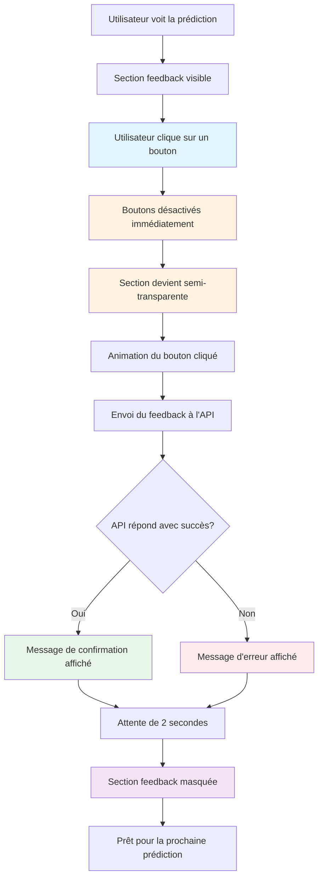

# Diagramme de Flux - Feedback UI

## Flux Utilisateur Amélioré



## États de l'Interface

### État Initial
- Section feedback visible
- Boutons actifs et cliquables
- Opacité normale (1.0)
- Événements de pointeur activés

### État Pendant le Feedback
- Boutons désactivés
- Section semi-transparente (0.5)
- Événements de pointeur désactivés
- Animation du bouton cliqué

### État Final
- Message de confirmation affiché
- Section masquée après 2 secondes
- Prêt pour la prochaine prédiction

## Code JavaScript Correspondant

```javascript
// 1. Clic sur un bouton
button.addEventListener('click', async function() {
    // 2. Désactivation immédiate
    document.querySelectorAll('.feedback-btn').forEach(btn => btn.disabled = true);
    
    // 3. Semi-transparence
    feedbackSection.style.opacity = '0.5';
    feedbackSection.style.pointerEvents = 'none';
    
    // 4. Animation
    this.classList.add('feedback-animation');
    
    // 5. Envoi à l'API
    const response = await fetch('/api/feedback', { ... });
    
    // 6. Gestion de la réponse
    if (response.ok) {
        // 7. Message de confirmation
        feedbackMessage.innerHTML = `...`;
        
        // 8. Masquage après 2 secondes
        setTimeout(() => {
            feedbackSection.style.display = 'none';
        }, 2000);
    }
});
```
