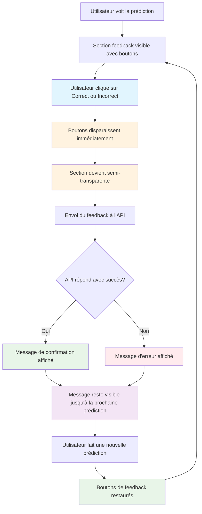

# Diagramme de Flux Final - Feedback UI avec Messages

## Flux Utilisateur Complet



## États de l'Interface

### 1. État Initial
```
┌─────────────────────────────────────┐
│  Cette prédiction vous semble-t-elle │
│  correcte ?                          │
│                                     │
│  [👍 Correct]  [👎 Incorrect]      │
└─────────────────────────────────────┘
```

### 2. État Pendant le Feedback
```
┌─────────────────────────────────────┐
│  Cette prédiction vous semble-t-elle │
│  correcte ?                          │
│                                     │
│  [Envoi en cours...]                │
└─────────────────────────────────────┘
```

### 3. État Succès
```
┌─────────────────────────────────────┐
│  ✅ Feedback enregistré !           │
│  Merci ! Votre feedback nous aide   │
│  à améliorer le modèle.        [×]  │
└─────────────────────────────────────┘
```

### 4. État Erreur
```
┌─────────────────────────────────────┐
│  ⚠️ Erreur !                        │
│  Impossible d'enregistrer votre     │
│  feedback. Réessayez plus tard. [×] │
└─────────────────────────────────────┘
```

## Code JavaScript Correspondant

### Gestion du Clic
```javascript
button.addEventListener('click', async function() {
    // 1. Désactiver immédiatement
    document.querySelectorAll('.feedback-btn').forEach(btn => btn.disabled = true);
    
    // 2. Semi-transparence
    feedbackSection.style.opacity = '0.5';
    feedbackSection.style.pointerEvents = 'none';
    
    // 3. Envoi à l'API
    const response = await fetch('/api/feedback', { ... });
    
    // 4. Gestion de la réponse
    if (response.ok) {
        // Remplacer par message de succès
        feedbackButtons.innerHTML = `
            <div class="alert alert-success alert-dismissible fade show">
                <i class="bi bi-check-circle-fill me-2"></i>
                <strong>Feedback enregistré !</strong> ${message}
                <button type="button" class="btn-close" data-bs-dismiss="alert"></button>
            </div>
        `;
    } else {
        // Remplacer par message d'erreur
        feedbackButtons.innerHTML = `
            <div class="alert alert-warning alert-dismissible fade show">
                <i class="bi bi-exclamation-triangle-fill me-2"></i>
                <strong>Erreur !</strong> Impossible d'enregistrer votre feedback.
                <button type="button" class="btn-close" data-bs-dismiss="alert"></button>
            </div>
        `;
    }
});
```

### Réinitialisation
```javascript
function resetFeedbackButtons() {
    // Restaurer les boutons originaux
    feedbackButtons.innerHTML = `
        <button class="btn btn-outline-success feedback-btn" data-feedback="positive">
            <i class="bi bi-hand-thumbs-up-fill"></i>
            <span>Correct</span>
        </button>
        <button class="btn btn-outline-danger feedback-btn" data-feedback="negative">
            <i class="bi bi-hand-thumbs-down-fill"></i>
            <span>Incorrect</span>
        </button>
    `;
    
    // Réattacher les événements
    attachFeedbackEvents();
}
```

## Avantages de cette Implémentation

### ✅ **Expérience Utilisateur**
- Feedback immédiat et clair
- Pas de confusion possible
- Interface propre et professionnelle

### ✅ **Sécurité**
- Empêche les clics multiples
- Gestion propre des erreurs
- Validation côté client et serveur

### ✅ **Maintenabilité**
- Code modulaire et réutilisable
- Gestion centralisée des événements
- Tests complets inclus

### ✅ **Accessibilité**
- Messages clairs et explicites
- Boutons de fermeture pour les messages
- Support des lecteurs d'écran

## Tests de Validation

### Tests Automatiques
- Feedback positif et négatif
- Gestion des erreurs
- Validation des données
- Authentification

### Tests Manuels
- Clic unique sur les boutons
- Affichage des messages
- Fermeture des messages
- Nouvelle prédiction

Cette implémentation offre une expérience utilisateur optimale tout en maintenant la robustesse et la maintenabilité du code.
